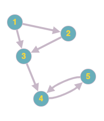
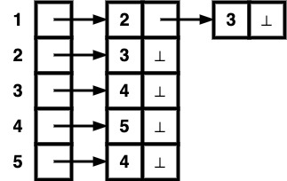

# CS 1501 – Lab #5 (Airline System)

## Table of Contents

- [Overview](#overview)
- [Directed Graphs](#directed-graphs)
- [AirlineSystem.java](#airlinesystemjava)
- [Testing](#testing)
- [Notes](#notes)

## Overview

* __Purpose__: In this lab you will complete the implementation of __`AirlineSystem.java`__,
a visualization program for an airline route map using directed graphs.

A starter project has been provided in this repository, with the following
directory contents.

```bash
├── AirlineSystem.java
├── README.md
├── docs/
├── img/
├── data1.txt
├── data2.txt
├── output1.txt
└── output2.txt
```

__`AirlineSystem.java`__ can read in an airline route data file (ex. `data1.txt`), construct a directed graph using the given vertices and edges, and print the graph's adjacency matrix similar to the sample output files (ex. `output1.txt`).


 In addition to the project files in the root directory, you can refer to the
 __`javadoc`__ documentation of the __`AirlineSystem`__ class inside
 __`docs/index.html`__ (you may safely disregard any other file within the
 __`docs/`__ subdirectory). It is an auto-generated class description webpage
 intended to provide neatly structured API documentation for developers, using the
 contents of __`@`__-tagged comment blocks within the source code. This is strictly
 optional however, and sometimes its easier to just read the comment blocks
 directly.

There are a total of __two__ code implementation tasks, each defined inside
numbered __`@TODO`__ objective comment blocks.

__`AirlineSystem.java`__ will compile into a executable class file that provides a simple filename prompt from which you will be able to test the correctness of your implementation against `data1.txt` and `data2.txt`, which should each match `output1.txt` and `output2.txt` respectively.


## Directed Graphs

A directed graph (Digraph) can be represented as a set of vertices and edges (just like undirected graphs), but each edge will be an ordered pair __(u,v)__ where an edge from __u__ to __v__ exists. Obviously, unless explicitly stated otherwise, the opposite direction cannot be assumed.

Storing a Digraph can be achieved through either an adjacency matrix or an adjacency list.
To demonstrate the two, we will use the following Digraph with unweighted edges.

<center>



</center>

<p align = "center">
Visualization of Digraph 1
</p>

Our sample Digraph can be defined as __$G = (V,E)$__, where $V = \{1,2,3,4,5\}$ and $E = \{(1,2),(1,3),(2,3),(3,4),(4,5),(5,4)\}$. When storing a directed graph on a computer, we can combine the two definitions into a single data structure that maps the adjacency (reachable through traversal) of each vertex in the graph.

An __Adjacency Matrix__ achieves this by creating an __N x N__ matrix where __N = |V|__, and each item in the matrix will denote whether there exists an edge from vertex __row__ to vertex __col__, with __1__ meaning edge exists and __0__ otherwise.

<center>

|   | 1 | 2 | 3 | 4 | 5 |
|---|---|---|---|---|---|
| 1 | 0 | 1 | 1 | 0 | 0 |
| 2 | 0 | 0 | 1 | 0 | 0 |
| 3 | 0 | 0 | 0 | 1 | 0 |
| 4 | 0 | 0 | 0 | 0 | 1 |
| 5 | 0 | 0 | 0 | 1 | 0 |

</center>

<p align = "center">
Adjacency Matrix for Digraph 1
</p>

Having an Adjacency Matrix allows for O(1) lookup for whether an edge is present from one vertex to another. However, it will always take up O($N^2$) space in memory, which not might be optimal for storing sparse graphs, where the number of vertices far outweigh the number of directed edges. Also, in order to enumerate all neighbors of a vertex it takes at minimum $\Omega(N)$ time.

An __Adjacency List__ is a length-N array with each element at index __`i`__ storing a pointer to a list of vertex __`i`__'s neighbors.

<center>



</center>

<p align = "center">
Adjacency List for Digraph 1
</p>

Unlike an Adjacency Matrix, an Adjacency List is space-efficient since it only has to store link information of existing edges. It is also more efficient to enumerate the neighbors of vertex __$u$__; It takes at most $O(deg(u))$, where $deg(v)$ outputs the outward degree of vertex __$v$__.

The downside of an Adjacency List is that simply checking whether edge __(u,v)__ exist may take $\Omega(deg(u))$, which could end up being $\Omega(N)$ time.


## AirlineSystem.java

In this lab, we will use an Adjacency List to build and store our Digraph object, which is better suited for our purposes of later printing out all available destinations from each city (which is just print-walking the final Adjacency List).

The __`Digraph`__ and __`DirectedEdge`__ classes are completed for you, and you will use these to parse a airline route data file into a complete Digraph, and finally print the Digraph out to the console.


## Testing

Compile the completed java file from your lab8 directory. Once compiled, you can run the class file without any additional runtime arguments.

```bash
$ cd #YOUR_LAB8_DIRECTORY
$ javac ./AirlineSystem.java
$ java AirlineSystem

```
Sample execution using `data1.txt`

```
Please enter graph filename:
data1.txt
Pittsburgh: Erie  Johnstown  Harrisburg  Philadelphia
Erie:
Altoona: Johnstown  Harrisburg
Johnstown:
Harrisburg: Philadelphia  Reading
Philadelphia: Scranton  Allentown
Scranton:
Reading: Allentown  Pittsburgh
Allentown:
```

## Notes

When reading in the number of vertices from a data file (first integer on first line) using __`fileScan.nextInt()`__, you may want to call a __`fileScan.nextLine()`__ before extracting city names. This is because __`Scanner.nextInt()`__ does not read the newline character of your input line after hitting __Enter__. You will have to manually call __`Scanner.nextLine()`__ to finish and move on to the next line.

```java
int count = fileScan.nextInt();
System.out.println("Count:" + count);

fileScan.nextLine();

String city1 = fileScan.nextLine();
System.out.println("city1:" + city1);
```

Alternatively, you can simply call __`fileScan.nextLine()`__ to get the numeric string of the first line and parse the string into an integer.

```java
String countstr = fileScan.nextLine();
System.out.println("countstr:" + countstr);

int count = Integer.parseInt(countstr);
System.out.println("Count:" + count);

String city1 = fileScan.nextLine();
System.out.println("city1:" + city1);
```
